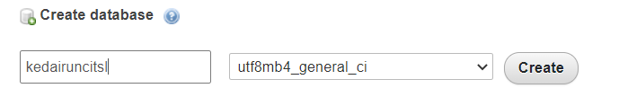

# Project title: POS Web SQL


### Introduction

This project is aiming to create a database in Web SQL for POS System. It is including the tables creation, data insertion, and retrieve the value from tables stored in Web SQL. In this project, the data that have been inserted into tables in Web SQL is the exported data from SQL file of the database in PhpMyAdmin. Another purpose of this project is to compare the last entered data into table based on the datetime in Web SQL. 

### Installation
To access this project, the software programs need to be installed:
* XAMPP Installer
	- https://www.apachefriends.org/download.html
* Any IDE; in this project, Visual Studio Code or PhpStorm is used.
	- Visual Studio Code: https://code.visualstudio.com/docs/?dv=win 
	- PhpStorm: https://www.jetbrains.com/phpstorm/download/#section=windows

Fistly, you need to create the database and tables in PhpMyAdmin, then insert the data into the tables. Below is the steps to create the database in PHPMyAdmin:

1. Open PHPMyAdmin (http://localhost/phpmyadmin)
2. ```Create a database with name kedairuncitsl```
     
     
3. Create tables with table name **category**, **supplier**, and **item**.
     * Table: category
     
     .png)
     
     * Table: supplier
     
     .png)
     
     * Table: item
     
     .png)
     

### Example/ Tutorial
* Create a PHP file named connection.php. This file use to connect the database.

```php
<?php
define("HOST", "localhost");     // The host you want to connect to.
define("USER", "root");    // The database username.
define("PASSWORD","");    // The database password.
define("DATABASE", "kedairuncitsl");    // The database name.
define("PASSWORD_KEY", "SMARTLAB");
define("QUOTES_GPC", (ini_get('magic_quotes_gpc') ? TRUE : FALSE));
date_default_timezone_set('Asia/Kuala_Lumpur');

try {
    $dbx = new PDO('mysql:host='.HOST.';dbname='.DATABASE, USER, PASSWORD);
    $dbx->setAttribute(PDO::ATTR_ERRMODE, PDO::ERRMODE_EXCEPTION);
    $dbx->setAttribute(PDO::ATTR_EMULATE_PREPARES, false);
} catch (PDOException $e) {
    print "Error!: " . $e->getMessage() . "<br/>";
    die();
}
?>
```

### Issue tracker for others
     https://github.com/nurulshafiqa/POS_SYSTEM/issues
     
### Code documentation
1) Require_once("connection.php)
```php
<?php
require_once("connection.php");
?>
```
* This code is used to require the PHP file where the code of database connection as shown in **Example/ Tutorial** section is saved. This code allowed the other PHP file to use the same database connection.

2) HTML
```html
<!DOCTYPE html>
<html lang="en">

<head>
    <meta charset="UTF-8">
    <title>Web SQL</title>
    <style>
        body{

        }
        table,tr,th,td{
            border-collapse:collapse;
            border: 1px solid black;

        }
        th{
            background-color: cadetblue;
            justify-content: center;
        }
        td,tr{
            background-color: lightgrey;
        }
    </style>

```
* This HTML code is used to define HTML tag and the css <style> tag is used to design the the HTML table.

     
3) Fetch data from database in PHPMyAdmin
     
```php
     <?php
        //fetch category
        $query = "SELECT * FROM category";
        $rs=$dbx->query($query);
        $category[] = "";
        while($dt=$rs->fetch()){
            $category[] = $dt;
        }
        //fetch item
        $query = "SELECT * FROM item";
        $rs=$dbx->query($query);
        $item[] = "";
        while($dt=$rs->fetch()){
            $item[] = $dt;
        }
      
        //fetch supplier
        $query = "SELECT * FROM supplier";
        $rs=$dbx->query($query);
        $supplier[] = "";
        while($dt=$rs->fetch()){
            $supplier[] = $dt;
        }
        ?>
```
* This php codes is used to fetch all the data from database in PHPMyAdmin and store the data in arrays.

4) Variables declarations
 ```javascript
 <script>
        var catDate="";
        var itemDate="";
        var supplierDate="";
```
* This code is used to declare the variables. In this case all variables above are declared as an empty string.
      
5) Function errorHandler
  ```javascript
  function errorHandler(transaction, error) {
            console.log('Oops. Error was '+error.message+' (Code '+error.code+')');
            return true;
        }
  ```
  
* What a function do
     - This function is used to write out any errors and it will console the error message.
     
* What the function's parameters or arguments are
     - **transaction** and **error** are the parameters for this function.
     
* What a function returns
     - This function will return boolean true if there's an error.

6) Fetch data from columns in table from PHPMyAdmin and into arrays
```php
      //fetch from column in table category and put as array
      var category = [
            <?php
            $i=0;
            foreach($category as $cat){
                if(!empty($cat)) {
                    echo($i > 0 ? "," : "");
                    echo "{
                                'code':'" . $cat['CAT_CODE'] . "',
                                'name':'" . $cat['CAT_NAME'] . "',
                                'desc' :'" . $cat['CAT_DESC'] . "',
                                'syncd' :'" . $cat['SYNCD'] . "'
                                }";
                    $i++;
                }
            }
            ?>
        ];

        //fetch from column in table item and put as array
        var item = [
            <?php
            $i=0;
            foreach($item as $itm){
                if(!empty($itm)) {
                    echo($i > 0 ? "," : "");
                    echo "{
                                'itemcode':'" . $itm['ITEM_CODE'] . "',
                                'itemname':'" . $itm['ITEM_NAME'] . "',
                                'itemprice' :'" . $itm['ITEM_PRICE'] . "',
                                'itemimage' :'" . $itm['ITEM_IMAGE'] . "',
                                'supplierComp' :'" . $itm['SUPP_COMPANY'] . "',
                                'cateName' :'" . $itm['CATEGORY_NAME'] . "',
                                'syncd' :'" . $itm['SYNCD'] . "'
                                }";
                    $i++;
                }
            }
            ?>
        ];
        //fetch from column in table supplier and put as array
        var supplier = [
            <?php
            $i=0;
            foreach($supplier as $supp){
                if(!empty($supp)) {
                    echo($i > 0 ? "," : "");
                    echo "{
                                'semail':'" . $supp['SUPP_EMAIL'] . "',
                                'sname':'" . $supp['SUPP_NAME'] . "',
                                'saddress' :'" . $supp['SUPP_ADDRESS'] . "',
                                'scompany' :'" . $supp['SUPP_COMPANY'] . "',
                                'sphone' :'" . $supp['SUPP_PHONE'] . "',
                                'scontact' :'" . $supp['SUPP_CONTACT'] . "',
                                 'syncd' :'" . $supp['SYNCD'] . "'
                                }";
                    $i++;
                }
            }
            ?>
        ];
 ```
 * This code is used to get all data stored in columns of the tables from PHPMyAdmin database and make it as arrays.     

7) Create Web SQL database      
      
```javascript
     var db;
        var latest;
        var shortName='POSMart';
        var version='0.1';
        var displayName='POSMart';
        var maxSize = 65536;
        db = openDatabase(shortName,version,displayName,maxSize);
```
* This code is used to create a Web SQL database      
      
      
8) Function runFunction()

```javascript
function runFunction() {
    createTablesAndInsert();
            getAllTables(getResult);
            getAllTablesFromDB(getResultSetFromTable);
     }
```
* What a function do
     - This function is used to call another functions
     
* What the function's parameters or arguments are
     - This function has no parameter
     
* What a function returns
     - This function has no return value.
 
 
9) Function createTablesAndInsert(callback)

```javascript
function createTablesAndInsert(callback) {
            db.transaction(function(transaction) {
                transaction.executeSql('DROP TABLE category',null,function(){console.log('Drop Succeeded');},function(){console.log('Drop Failed');});
                transaction.executeSql(
                    'CREATE TABLE IF NOT EXISTS category ' +
                    ' (CAT_CODE VARCHAR(20) NOT NULL PRIMARY KEY, ' +
                    ' CAT_NAME VARCHAR(30) DEFAULT NULL, CAT_DESC VARCHAR(256) DEFAULT NULL,'+
                    ' SYNCA varchar(50) DEFAULT NULL, SYNCB varchar(50) DEFAULT NULL, SYNCD datetime DEFAULT CURRENT_TIMESTAMP,' +
                    ' SYNMA varchar(50) DEFAULT NULL, SYNMB varchar(50) DEFAULT NULL, SYNMD datetime DEFAULT NULL);'
                );

                transaction.executeSql('DROP TABLE supplier',null,function(){console.log('Drop Succeeded');},function(){console.log('Drop Failed');});

                transaction.executeSql(
                    'CREATE TABLE IF NOT EXISTS supplier ' +
                    ' (SUPP_EMAIL VARCHAR(30) NOT NULL PRIMARY KEY, ' +
                    ' SUPP_NAME VARCHAR(30) DEFAULT NULL, SUPP_ADDRESS VARCHAR(100) DEFAULT NULL,' +
                    ' SUPP_COMPANY VARCHAR(30) DEFAULT NULL, SUPP_PHONE VARCHAR(15) DEFAULT NULL,' +
                    ' SUPP_CONTACT VARCHAR(15) DEFAULT NULL,' +
                    ' SYNCA varchar(50) DEFAULT NULL, SYNCB varchar(50) DEFAULT NULL, SYNCD datetime DEFAULT CURRENT_TIMESTAMP,' +
                    ' SYNMA varchar(50) DEFAULT NULL, SYNMB varchar(50) DEFAULT NULL, SYNMD datetime DEFAULT NULL);'
                );

                transaction.executeSql('DROP TABLE item',null,function(){console.log('Drop Succeeded');},function(){console.log('Drop Failed');});

                transaction.executeSql(
                    'CREATE TABLE IF NOT EXISTS item ' +
                    ' (ITEM_CODE VARCHAR(20) NOT NULL PRIMARY KEY, ' +
                    ' ITEM_NAME VARCHAR(20) DEFAULT NULL, ITEM_IMAGE LONGBLOB DEFAULT NULL,' +
                    ' ITEM_PRICE DOUBLE DEFAULT NULL, SUPP_COMPANY VARCHAR(30) DEFAULT NULL,' +
                    ' CATEGORY_NAME VARCHAR(20) DEFAULT NULL,' +
                    ' SYNCA varchar(50) DEFAULT NULL, SYNCB varchar(50) DEFAULT NULL, SYNCD datetime DEFAULT CURRENT_TIMESTAMP,' +
                    ' SYNMA varchar(50) DEFAULT NULL, SYNMB varchar(50) DEFAULT NULL, SYNMD datetime DEFAULT NULL);'
                );

                db.transaction(
                    function(transaction) {
                        for (var i = 0; i < category.length; i++) {
                            console.log('Attempting to insert ' + category[i]["code"] + category[i]["name"] + 'and' +  category[i]["name"]);
                            transaction.executeSql(
                                'INSERT INTO category (CAT_CODE, CAT_NAME, CAT_DESC, SYNCD) VALUES (?,?,?,?);',
                                [category[i]["code"], category[i]["name"], category[i]["desc"],category[i]["syncd"]],
                                null,
                                errorHandler

                            );

                        }

                        for (var i = 0; i < supplier.length; i++) {
                            console.log('Attempting to insert ' + supplier[i]["semail"] + ',' + supplier[i]["sname"] + ',' + supplier[i]["saddress"] + ',' + supplier[i]["scompany"] + ',' + supplier[i]["sphone"] + ' and ' + supplier[i]["scontact"]);
                            transaction.executeSql(
                                'INSERT INTO supplier (SUPP_EMAIL, SUPP_NAME, SUPP_ADDRESS, SUPP_COMPANY,SUPP_PHONE, SUPP_CONTACT, SYNCD) VALUES (?,?,?,?,?,?,?);',
                                [supplier[i]["semail"], supplier[i]["sname"],supplier[i]["saddress"],supplier[i]["scompany"],supplier[i]["sphone"],supplier[i]["scontact"],supplier[i]["syncd"]],
                                null,
                                errorHandler
                            );
                        }

                        for (var i = 0; i < item.length; i++) {
                            console.log('Attempting to insert ' + item[i]["itemcode"] + ',' + item[i]["itemname"] + ',' + item[i]["itemprice"] + ',' + item[i]["itemimage"] +   ',' + item[i]["supplierComp"] + ' and ' + item[i]["cateName"]);
                            transaction.executeSql(
                                'INSERT INTO item (ITEM_CODE, ITEM_NAME, ITEM_PRICE,ITEM_IMAGE, SUPP_COMPANY,CATEGORY_NAME,SYNCD) VALUES (?,?,?,?,?,?,?);',
                                [item[i]["itemcode"], item[i]["itemname"], item[i]["itemprice"], item[i]["itemimage"], item[i]["supplierComp"],item[i]["cateName"],item[i]["syncd"]],
                                null,
                                errorHandler
                            );
                        }
                    });
            });


        }// end createDB fx

```
* What a function do
     - This function is used to create tables which is table category, supplier, and item in Web SQL. It is also used to insert data into those tables.
     
* What the function's parameters or arguments are
     - This function has callback as the parameter (function that is passed as an argument to another function, to be “called back” at a later time.)
     
* What a function returns
     - This function has no return value.
 
10) Function getAllTablesFromDB()
 ```javascript
   function getAllTablesFromDB(callback) {
            db.transaction(function(tx) {
                tx.executeSql('SELECT tbl_name from sqlite_master WHERE type = "table"', [], function(tx, results) {
                    callback(results, processResultSet);
                });
            });
        }
 ```
* What a function do
     - This function is used to select tables name from built-in Web SQL table which is **sqlite_master** table and call another function which is processResultSet function to display all data inserted into the table in HTML table
     
* What the function's parameters or arguments are
     - This function has callback as the parameter (function that is passed as an argument to another function, to be “called back” at a later time.)
     
* What a function returns
     - This function has no return value.

11) Function getResultSetFromTable(results, callback)     
```javascript
   function getResultSetFromTable(results, callback) {
            var length = results.rows.length;
            var j = 0;
            for (var i = 0; i < length; i++) {
                db.transaction(function(tx) {
                    var k=0,tblname=results.rows[j++].tbl_name;
                    tx.executeSql('SELECT * FROM ' + tblname , [], function(tx, results) {
                        callback(tblname,results);
                    });
                });
            }

        }
```
* What a function do
     - This function is used to get how many tables are stored by (var length = results.rows.length;), then perform SELECT SQL queries to select all data from table name.
     
* What the function's parameters or arguments are
     - This function has callback as the parameter (function that is passed as an argument to another function, to be “called back” at a later time.) and results is also the parameter of this funtion
     
* What a function returns
     - This function has no return value.

12) Fuction processResultSet(tblname,results)
```javascript
	  //table

        function processResultSet(tblname,results) {
            if(tblname=="category"){
                console.log('----------------------'+tblname)
                var len = results.rows.length;
                var tbl = document.createElement('table');
                var trTblName = document.createElement('tr');
                var thTblName = document.createElement('th');
                thTblName.innerHTML = tblname;
                trTblName.colSpan = 2;
                trTblName.appendChild(thTblName);
                tbl.appendChild(trTblName);

                var trHeader = document.createElement('tr');
                var th1 = document.createElement('th');
                th1.innerHTML = 'Category Code';
                var th2 = document.createElement('th');
                th2.innerHTML = 'Category Name';
                var th3 = document.createElement('th');
                th3.innerHTML = 'Description';
                // var th4 = document.createElement('th');
                // th4.innerHTML = 'SYNCD';
                trHeader.appendChild(th1);
                trHeader.appendChild(th2);
                trHeader.appendChild(th3);
                //trHeader.appendChild(th4);
                tbl.appendChild(trHeader);

                for (var i = 0; i < category.length; i++) {
                    var tr = document.createElement('tr');
                    var td1 = document.createElement('td');
                    td1.innerHTML = results.rows[i].CAT_CODE;
                    var td2 = document.createElement('td');
                    td2.innerHTML = results.rows[i].CAT_NAME;
                    var td3 = document.createElement('td');
                    td3.innerHTML = results.rows[i].CAT_DESC;
                    // var td4 = document.createElement('td');
                    // td4.innerHTML = results.rows[i].SYNCD;
                    tr.appendChild(td1);
                    tr.appendChild(td2);
                    tr.appendChild(td3);
                    //tr.appendChild(td4);
                    tbl.appendChild(tr);
                }
                var body = document.getElementsByTagName('body')[0];
                body.appendChild(tbl);
                body.appendChild(document.createElement('br'));
                body.appendChild(document.createElement('br'));
                //body.appendChild(document.createElement('hr'));


            }
            else if(tblname=="item"){
                console.log('----------------------'+tblname)
                var len = results.rows.length;
                var tbl = document.createElement('table');
                var trTblName = document.createElement('tr');
                var thTblName = document.createElement('th');
                thTblName.innerHTML = tblname;
                trTblName.colSpan = 2;
                trTblName.appendChild(thTblName);
                tbl.appendChild(trTblName);

                var trHeader = document.createElement('tr');
                var th1 = document.createElement('th');
                th1.innerHTML = 'Item Code';
                var th2 = document.createElement('th');
                th2.innerHTML = 'Item Name';
                var th3 = document.createElement('th');
                th3.innerHTML = 'Item Price';
                var th4 = document.createElement('th');
                th4.innerHTML = 'Item Image';
                var th5 = document.createElement('th');
                th5.innerHTML = 'Supplier Company';
                var th6 = document.createElement('th');
                th6.innerHTML = 'Category Name';
                // var th7 = document.createElement('th');
                // th7.innerHTML = 'SYNCD';
                trHeader.appendChild(th1);
                trHeader.appendChild(th2);
                trHeader.appendChild(th3);
                trHeader.appendChild(th4);
                trHeader.appendChild(th5);
                trHeader.appendChild(th6);
                //trHeader.appendChild(th7);
                tbl.appendChild(trHeader);

                for (var i = 0; i < item.length; i++) {
                    var tr = document.createElement('tr');
                    var td1 = document.createElement('td');
                    td1.innerHTML = results.rows[i].ITEM_CODE;
                    var td2 = document.createElement('td');
                    td2.innerHTML = results.rows[i].ITEM_NAME;
                    var td3 = document.createElement('td');
                    td3.innerHTML = results.rows[i].ITEM_PRICE;
                    var td4 = document.createElement('td');
                    td4.innerHTML = results.rows[i].ITEM_IMAGE;
                    var td5 = document.createElement('td');
                    td5.innerHTML = results.rows[i].SUPP_COMPANY;
                    var td6 = document.createElement('td');
                    td6.innerHTML = results.rows[i].CATEGORY_NAME;
                    // var td7 = document.createElement('td');
                    // td7.innerHTML = results.rows[i].SYNCD;
                    tr.appendChild(td1);
                    tr.appendChild(td2);
                    tr.appendChild(td3);
                    tr.appendChild(td4);
                    tr.appendChild(td5);
                    tr.appendChild(td6);
                    //tr.appendChild(td7);
                    tbl.appendChild(tr);
                }
                var body = document.getElementsByTagName('body')[0];
                body.appendChild(tbl);
                body.appendChild(document.createElement('br'));
                //body.appendChild(document.createElement('hr'));
            }
            else{
                console.log('----------------------'+tblname)
                var len = results.rows.length;
                var tbl = document.createElement('table');
                var trTblName = document.createElement('tr');
                var thTblName = document.createElement('th');
                thTblName.innerHTML = tblname;
                trTblName.colSpan = 2;
                trTblName.appendChild(thTblName);
                tbl.appendChild(trTblName);

                var trHeader = document.createElement('tr');
                var th1 = document.createElement('th');
                th1.innerHTML = 'Supplier Email';
                var th2 = document.createElement('th');
                th2.innerHTML = 'Supplier Name';
                var th3 = document.createElement('th');
                th3.innerHTML = 'Supplier Address';
                var th4 = document.createElement('th');
                th4.innerHTML = 'Company Name';
                var th5 = document.createElement('th');
                th5.innerHTML = 'Phone Number';
                var th6 = document.createElement('th');
                th6.innerHTML = 'Contact Person';
                // var th7 = document.createElement('th');
                // th7.innerHTML = 'SYNCD';
                trHeader.appendChild(th1);
                trHeader.appendChild(th2);
                trHeader.appendChild(th3);
                trHeader.appendChild(th4);
                trHeader.appendChild(th5);
                trHeader.appendChild(th6);
               // trHeader.appendChild(th7);
                tbl.appendChild(trHeader);

                for (var i = 0; i < supplier.length; i++) {
                    var tr = document.createElement('tr');
                    var td1 = document.createElement('td');
                    td1.innerHTML = results.rows[i].SUPP_EMAIL;
                    var td2 = document.createElement('td');
                    td2.innerHTML = results.rows[i].SUPP_NAME;
                    var td3 = document.createElement('td');
                    td3.innerHTML = results.rows[i].SUPP_ADDRESS;
                    var td4 = document.createElement('td');
                    td4.innerHTML = results.rows[i].SUPP_COMPANY;
                    var td5 = document.createElement('td');
                    td5.innerHTML = results.rows[i].SUPP_PHONE;
                    var td6 = document.createElement('td');
                    td6.innerHTML = results.rows[i].SUPP_CONTACT;
                    // var td7 = document.createElement('td');
                    // td7.innerHTML = results.rows[i].SYNCD;
                    tr.appendChild(td1);
                    tr.appendChild(td2);
                    tr.appendChild(td3);
                    tr.appendChild(td4);
                    tr.appendChild(td5);
                    tr.appendChild(td6);
                    //tr.appendChild(td7);
                    tbl.appendChild(tr);
                }
                var body = document.getElementsByTagName('body')[0];
                body.appendChild(tbl);
                body.appendChild(document.createElement('br'));
                body.appendChild(document.createElement('br'));
                //body.appendChild(document.createElement('hr'));
            }

        }
```
* What a function do
     - This function is used to display the data from the table name in the HTML table
     
* What the function's parameters or arguments are
     - tblname and results are the parameters for this function
     
* What a function returns
     - This function has no return value.

13) Function getAllTables(callback)
```javascript
function getAllTables(callback) {
            db.transaction(function(tx) {
                tx.executeSql('SELECT tbl_name from sqlite_master WHERE type = "table" ', [], function(tx, results) {
                     callback(results, processResult);
                });
            });
        }
```
* What a function do
     - This function is used to select tables name from built-in Web SQL table which is **sqlite_master** table and call another function which is processResult function to get the last date of record that has been added into the SQL tables.
     
* What the function's parameters or arguments are
     - This function has callback as the parameter (function that is passed as an argument to another function, to be “called back” at a later time.)
     
* What a function returns
     - This function has no return value. 
										  
14) function getResult(results, callback)
```javascript
function getResult(results, callback) {
            var length = results.rows.length;
            var j = 0;
            for (var i = 0; i < length; i++) {
                db.transaction(function(tx) {
                    var k=0,tblname=results.rows[j++].tbl_name;
                    tx.executeSql('SELECT SYNCD FROM ' + tblname  , [], function(tx, results) {
                        callback(tblname,results);
                    });
                });
            }

        }
```
* What a function do
     - This function is used to get how many tables are stored by (var length = results.rows.length;), then perform SELECT SQL queries to select column name which is column SYNCD that stores the datetime of records from all table name.
     
* What the function's parameters or arguments are
     - This function has callback as the parameter (function that is passed as an argument to another function, to be “called back” at a later time.) and results is also the parameter of this funtion
     
* What a function returns
     - This function has no return value.

15) Function processResult(tblname,results)
```javascript	 
function processResult(tblname,results) {
            if(tblname=="category"){
                var i = category.length - 1;
                catDate = results.rows[i].SYNCD;
                console.log("Last category date:" + catDate);
                var lastCat = "<p> Last category date: " +catDate+ "</p>";
                document.querySelector('#lastDate').innerHTML += lastCat;
                return catDate;


            }
            else if(tblname=="item"){
                var i = item.length - 1;
                itemDate = results.rows[i].SYNCD;
                console.log("Last item date:" + itemDate);
                var lastItem = "<p> Last item date: " +itemDate+ "</p>";
                document.querySelector('#lastDate').innerHTML += lastItem;
                return itemDate;
            }
            else{
                var i = supplier.length - 1;
                supplierDate = results.rows[i].SYNCD;
                console.log("Last supplier date:" + supplierDate);
                var lastSupp = "<p> Last supplier date: " +supplierDate+ "</p>";
                document.querySelector('#lastDate').innerHTML += lastSupp;
                return supplierDate;

        }}
    </script>
```
* What a function do
     - This function is used to check the table name, if yes then it will get the last record of all tables based on SYNCD.
     
* What the function's parameters or arguments are
     - tblname and results are the parameters for this function
     
* What a function returns
     - This function has no return value.
	
16) HTML 
```html
</head>

<body onload="runFunction()">

<div id="latestDate" name="latestDate"><h1>Latest Datetime from PhpMyAdmin:</h1></div>
<br><br>
<div id="lastDate" name="lastDate"><h1>Latest Datetime from Web SQL:</h1></div>
<br><br>
</body>
</html>
```
* The onload in body tag is used to call the Javascript function named runFunction()
* Both div HTML tag is used for the Javascript function to display the data in HTML page.
